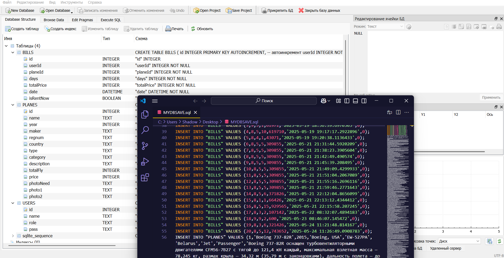

# BPR
[ENGLISH]

**WPF Application of the Belarus Plane Rent System**

---

**Workflow:**

### Database
*(SQLite. For backup and restore use the MYDBSAVE.sql file)*

### Start Window
*The user must register or log in to an existing account*

### Catalog of Available Aircraft for Rent
*Rental includes the aircraft only (no fuel or crew)*

### Filtering, Sorting & Search
*The user can apply filters, sort the list, or search to find the desired aircraft*

### Detailed Aircraft Information
*The user can view full details and photos of the selected aircraft before making a preliminary reservation*

### Preliminary Rental Request
*Generates a rental request form populated with user and aircraft data*

### Admin Panel
*The administrator can add, edit, and delete aircraft, as well as view booking records and overall statistics*

### Reports & Statistics Generation

---

**Terms of Use:**

*This project may be used and distributed only with attribution to the author (CasualMan228 or ConusGames)*

---

[РУССКИЙ]

**WPF приложение системы аренды самолетов Беларуси (Belarus Plane Rent)**

---

**Алгоритм работы:**
### База данных (Используется SQLite. Для резервного копирования и восстановления БД - файл MYDBSAVE.sql)

### Стартовое окно
* Пользователю необходимо зарегистрироваться или войти в уже существующую учетную запись

### Каталог доступных самолетов для аренды
* Аренда включает только самолет (без топлива и экипажа)

### Фильтрация, сортировка и поиск
* Пользователь может использовать фильтры, сортировку и поиск, чтобы найти нужный ему самолет

### Детальная информация о выбранном самолете
* Пользователь может ознакомиться с подробной информацией о выбранном самолете, его фотографиями перед предварительным бронированием

### Предварительная заявка на аренду
* Генерация формы заявки с данными пользователя и выбранного самолета

### Админ-панель
* Администратор может добавлять, изменять и удалять самолеты. Также просматривать учет бронирований и общую статистику

### Генерация отчетов и статистики

---

**Условия использования:**

*Данный проект разрешается использовать и распространять только с указанием автора (CasualMan228 или ConusGames)*
